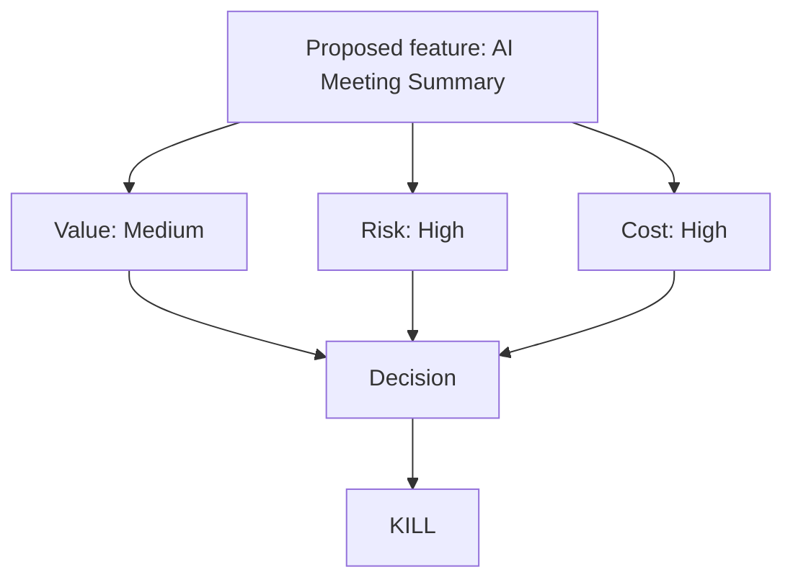

# Kill the Feature: Why We Shouldn't Build This AI Capability

> Most portfolios show what someone built. This one shows what I stopped, and why.

**Portfolio category:** JUDGMENT — *the ability to stop low-value work, explain why, and redirect investment toward a better opportunity.*

**Classification: Portfolio scenario.** A fictional enterprise proposes an AI capability. This is not a claimed employer decision — it's built to demonstrate a decision-making method: how to evaluate whether a feature is worth building at all, before anyone spends real engineering time finding out the hard way.

---

## The Proposal

**AI Meeting Summary** — a feature that automatically summarizes employee meetings and distributes the summary to attendees and stakeholders.

At first glance, it looks like an easy win: meetings are a widely shared complaint, AI summarization is mature technology, and "AI Meeting Summary" is the kind of feature that sounds good in a roadmap review.

## The Core Question

> Is this feature valuable enough to justify the cost, risk, complexity, and opportunity cost — not "is this technically possible," but "should we build it"?

## Why This Matters

Most feature evaluations stop at "can we build this" and "would some people like it." Both answers here are yes. Neither answer is the same as "should we build this instead of something else with our limited capacity." A portfolio full of things I built says I can execute. This project shows I can also tell the difference between a feature that sounds valuable and one that actually is — before the organization spends the engineering, governance, and trust budget finding out.

## My Role (Scenario)

In this scenario, I act as the product/program leader responsible for evaluating the proposal before it enters a delivery roadmap — running the research synthesis, sizing the opportunity, assessing risk, and writing the decision memo.

## Analysis Summary

| Dimension | Finding |
|---|---|
| User need | Real, but already partially served by existing tools and habits — see [Findings](user-research/findings.md) |
| Existing alternatives | Manual notes, calendar recordings with existing transcription tools, action-item habits already in place | 
| Incremental value | Medium at best — see [Opportunity Sizing](opportunity-sizing/opportunity.md) |
| Cost | High — engineering, infrastructure, ongoing support, governance | 
| Risk | High — privacy, data retention, accuracy, trust | 
| Opportunity cost | Would delay a higher-frequency, higher-confidence initiative — see [Alternatives Analysis](alternatives/alternatives-analysis.md) |

## Decision

**Do not build AI Meeting Summary.**

**Why:** Low-to-medium incremental value once existing alternatives are accounted for, combined with high implementation cost, significant privacy and governance risk, and an opportunity cost that would delay a higher-value initiative.

Full reasoning in the [Decision Memo](decision-memo/decision.md).

## Redirect

Recommend redirecting the investment toward an **enterprise knowledge retrieval experience** — a higher-frequency, better-evidenced information-discovery problem that the same underlying AI capability (summarization and retrieval) could serve with materially lower privacy risk, since it operates on documents people have already chosen to make searchable rather than on live conversations.

## Key Insight

The feature's apparent value came from how easy it is to imagine someone liking it, not from evidence that the problem was under-served or that the risk was manageable. "People would probably use this" is a low bar; the harder and more useful question is whether this is the best use of the same capability, budget, and trust the organization has to spend.

## What I Would Do Next

- Revisit this decision if a specific team demonstrates a validated, high-frequency need that existing tools genuinely don't meet — the decision is a "not now, not like this," not a permanent ban on the concept.
- Apply the same kill/build evaluation method as a standing gate for future AI feature proposals, not just a one-time exercise for this one.

## Artifacts

| Folder | Contents |
|---|---|
| [`feature-proposal/`](feature-proposal/) | The original proposal as pitched |
| [`user-research/`](user-research/) | Research plan and synthesized findings |
| [`opportunity-sizing/`](opportunity-sizing/) | Opportunity sizing and documented assumptions |
| [`risk-analysis/`](risk-analysis/) | Risk register across privacy, security, trust, governance |
| [`alternatives/`](alternatives/) | Existing alternatives and opportunity-cost analysis |
| [`decision-memo/`](decision-memo/) | The kill decision and rationale |
| [`post-decision/`](post-decision/) | Lessons learned and the revisit trigger |
| [`interview/`](interview/) | 30-second / 2-minute / 5-minute talking points |

## Skills Demonstrated

Product judgment · Cost/value/risk analysis · Opportunity-cost reasoning · Privacy and governance risk assessment · Executive decision communication · Prioritization discipline

---

## Source Notes

This entire repository is a **portfolio scenario** built to demonstrate a decision-making method for evaluating whether a feature should be built at all. "AI Meeting Summary," the findings, and the decision are fictional and created for this exercise. The evaluation method — separate value from cost from risk, name the opportunity cost, and recommend a redirect rather than stopping at "no" — reflects how I approach real feature and initiative prioritization in my program management work.
